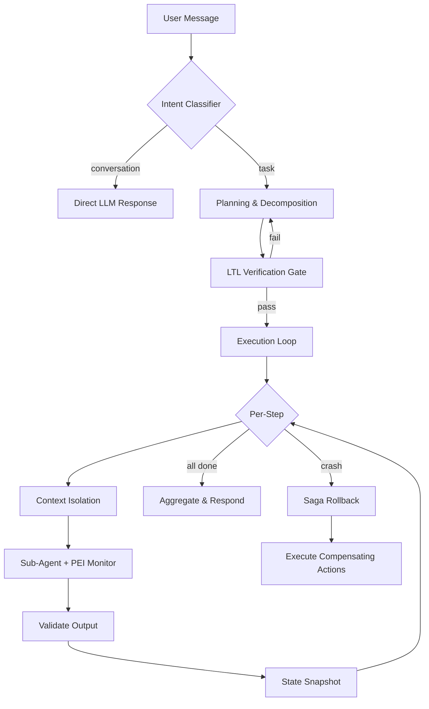

# FRAME-MO v2: Reliable Agentic Architecture Redesign

Transform from a rigid 4-agent dashboard into a flexible, fault-resilient AI agent with Claude-like conversational UX.

## Problem Statement

The current system has three fundamental weaknesses:
1. **Hardcoded agents** — Adding a new agent requires touching 8+ files (orchestrator, prompts, schemas, configs, frontend)
2. **No pre-flight safety** — Plans execute immediately with no verification
3. **No rollback** — When Step 4 crashes, Steps 1-3 leave corrupted state behind
4. **Not conversational** — "hi" crashes the system because everything is treated as a multi-agent task

---

## Proposed Architecture



---

## Proposed Changes

### Component 1: Dynamic Agent Registry

Make agents self-describing so the orchestrator discovers them automatically.

---

#### [MODIFY] [base_agent.py](file:///Users/jivitrana/Desktop/TaskForge/backend/agents/base_agent.py)

Add class-level metadata that the orchestrator reads at init:

```python
class BaseAgent(ABC):
    agent_name: str = "base_agent"
    agent_description: str = ""           # NEW — one-liner for LLM routing
    routing_parameters: dict = {}         # NEW — JSON schema for the routing tool
    tool_names: list[str] = []
    mcp_server: str = ""
    compensating_actions: dict = {}       # NEW — rollback instructions per action
```

Each subclass (ResearchAgent, CodeAgent, etc.) already has `agent_name`, `tool_names`, and `mcp_server`. We just add `agent_description`, `routing_parameters`, and `compensating_actions`.

---

#### [MODIFY] [orchestrator.py](file:///Users/jivitrana/Desktop/TaskForge/backend/core/orchestrator.py)

**Major refactor** — delete the 120-line hardcoded `ROUTING_TOOLS` and `TOOL_TO_AGENT` dictionaries. Replace with:

1. **Dynamic tool builder** — `__init__` iterates `AGENT_REGISTRY` and builds routing tools + a `direct_reply` tool from agent metadata.
2. **Intent classification** — Before planning, classify intent as `conversation` vs `task`. Conversations bypass agents entirely and go straight to LLM response.
3. **LTL Verification Gate** — After planning, scan the plan for logical constraint violations before executing.
4. **PEI Monitor** — During each agent step, track tool call count and intent drift. Kill a sub-agent if it loops or drifts.
5. **Saga Recovery** — If a step fails after retries, execute compensating actions for all previously completed steps in reverse order.

Delete: `_parse_plan_from_text`, the hardcoded greeting bypass, `ROUTING_TOOLS`, `TOOL_TO_AGENT`.

---

#### [NEW] [core/ltl_verifier.py](file:///Users/jivitrana/Desktop/TaskForge/backend/core/ltl_verifier.py)

Pre-flight plan verification. Checks:
- No write-before-read violations (e.g., can't email results before research completes)
- No duplicate agent routes
- HITL is set for all irreversible actions
- Step ordering respects `depends_on` constraints

Returns `{valid: bool, violations: list[str]}`. If invalid, the orchestrator rewrites the plan.

---

#### [NEW] [core/pei_monitor.py](file:///Users/jivitrana/Desktop/TaskForge/backend/core/pei_monitor.py)

Per-Execution-Instance monitor that wraps each sub-agent step:
- Tracks tool call count (kills after 10 calls — hallucination loop guard)
- Detects intent drift (compares each tool call against original task description via embedding similarity)
- Enforces a hard timeout (30s per agent step)

---

#### [NEW] [core/saga.py](file:///Users/jivitrana/Desktop/TaskForge/backend/core/saga.py)

Saga-pattern compensating transaction engine:
- Reads `compensating_actions` from each agent's metadata
- On failure, walks the checkpoint snapshots backward
- Executes compensating actions (e.g., delete the Notion page that was created, close the GitHub issue)
- Logs every rollback action to the error_log

---

### Component 2: Schema Updates

---

#### [MODIFY] [execution_plan.py](file:///Users/jivitrana/Desktop/TaskForge/backend/schemas/execution_plan.py)

Add to `SubTask`:
```python
compensating_action: str = ""   # What to do if this step needs rollback
verified: bool = False          # Set by LTL verifier
```

Add to `ExecutionPlan`:
```python
ltl_verified: bool = False
verification_notes: str = ""
```

---

#### [MODIFY] [agent_state.py](file:///Users/jivitrana/Desktop/TaskForge/backend/schemas/agent_state.py)

Add new fields:
```python
saga_log: list = field(default_factory=list)        # Rollback actions taken
pei_violations: list = field(default_factory=list)  # PEI monitor flags
intent_type: str = "task"  # "conversation" | "task"
```

Add new status literal: `"rolling_back"`

---

### Component 3: Prompts & Config

---

#### [MODIFY] [prompts.py](file:///Users/jivitrana/Desktop/TaskForge/backend/config/prompts.py)

- Update orchestrator prompt to include `direct_reply` tool and dynamic agent table
- Add instruction: "If the user is greeting you, asking a question, or making small talk, use the `direct_reply` tool instead of routing to any agent."

---

### Component 4: API & Frontend

---

#### [MODIFY] [api.py](file:///Users/jivitrana/Desktop/TaskForge/backend/api.py)

- Add `direct_reply` event to WebSocket broadcast
- Include `saga_log` and `pei_violations` in status responses
- Stop the infinite WS reconnect loop for failed/complete tasks

---

#### [MODIFY] [App.jsx](file:///Users/jivitrana/Desktop/TaskForge/frontend/src/App.jsx)

- When `intent_type === "conversation"`, render the AI reply as plain text with no tool-use collapsible
- When `intent_type === "task"`, show the tool-use dropdown with agent logs
- Add Saga rollback indicator (amber warning when rolling back)
- Fix the infinite WS reconnect loop

---

## User Review Required

> [!IMPORTANT]
> **New files created**: `core/ltl_verifier.py`, `core/pei_monitor.py`, `core/saga.py`
> **Major rewrites**: `core/orchestrator.py` (dynamic routing + intent classification), `agents/base_agent.py` (self-describing agents)
> **All 4 agent subclasses** get new class attributes but no logic changes

> [!WARNING]
> The Saga rollback compensating actions are **best-effort** — if the GitHub API is down, we can't delete the issue we created. The saga engine logs the failure but doesn't retry indefinitely.

> [!CAUTION]
> The PEI monitor's intent-drift detection uses a simple keyword overlap heuristic (not embeddings) to keep it fast and dependency-free. This may produce false positives on very short task descriptions.

## Verification Plan

### Automated Tests
1. `python main.py --serve` starts cleanly
2. Send "hi" → get direct text reply, no agents invoked
3. Send "Research AI trends and save to Notion" → plan generated, LTL verified, agents execute with PEI monitoring
4. `--inject-failure notion:rate_limit` → saga rollback triggers, compensating actions logged
5. Frontend shows correct UI for both conversation and task modes

### Manual Verification
- Review the saga_log in the API response after a triggered failure
- Confirm the WS reconnect loop stops on terminal states
